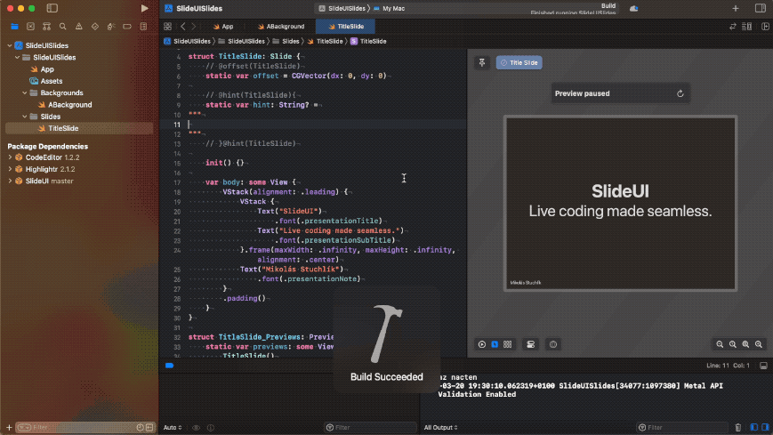

# SlideUI

Slides made in `SlideUI` leverage the power of `SwiftUI` allowing you to presesent Web, Code and more on a single Prezi-like plane!



## What is the `SlideUI`

`SlideUI` is a Swift Package, that provides set of predefined `SwiftUI` Views and types allowing you to compose a presentation that is able to compile code, execute `SwiftUI` Views, integrate Web View and anything the `SwiftUI` can do.

### Is `SlideUI` for me, or should I stick with Keynote?

`SlideUI` is useful, when you want to save some precious time during the presentation - either by integrating resources directly to your presentation or making things just a little bit more clear by smart organization of slides on the Prezi-like plane.

On the other hand, if your presentation is text/image heavy, you don't have any live coding to show or you're not familiar with `SwiftUI`, you're going to be better served by conventional software, just like Keynote.
Also remember, that the presentation is a running program and an error in your code may crash the presentation. I always double-check my live coding examples before the talk.

## Creating a new project

In order to run `SlideUI`, you will need the macOS 13 or newer.

### Install templates and create project
 - The project contains Project and Slide templates in the directory `Templates`. Copy the contents of the `Templates` directory to Xcode default template directory:
```
cp -r /path/to/SlideUI/Templates/* ~/Library/Developer/Xcode/Templates
```

 - Open `Xcode`, select `File -> New -> Project`. In template popup select category "Other" and "Slide App".
 - Give name to your project and select Team `none`.
 - The first line contains `#error` line. Copy link to the SlideUI repository and delete the line.
 ```swift
 `#error("Add Swift Package https://github.com/mikolasstuchlik/SlideUI.git")`
 ```
 - Add the SlideUI Package Dependency from branch `master` and add all targets provided by the SlideUI package.
 - Ensure, that in `Signing & Capabilites` ensure, that `Signing Certificate` is set to `Sign to Run Locally`

### Run the presentation
Run the presentation by using Compile and Run. (Notice, that in some cases it might be beneficial to build the presentation for Release.)

The application will launch a windows called Control Panel. The presentation itself is launched by the big green "play" button.

If your presentation contains some instances of `SwitchView`, you may want to generate thumbnail by clicking "Reload Previews" in the Control Panel - **after the presentation is launched and resized.**

## Usage

### Important types
The three most important types of the `SlideUI` are `Slide`, `Background` and `Focus`. All `Slide` views have equal size.
 - `Slide` is a type of `SwiftUI.View`, that is used to create a slide in our presentation.
 - `Background` is a type of `SwiftUI.View`, that is optimized for decorating your presentation with additional resources like shapes, images etc. Unlike `Slide`, a `Background` allows you to create the view as big or small as you want.
 - `Focus` is an element of ordered array - it allows you to specify the order in which you want to go through your slides.
 
 All types of `Slide`, `Background` and instances of `Focus` must be added to the `App.swift` file.
 
 ```swift
 private let backgrounds: [any Background.Type] = [
    ABackground.self,
]

private let slides: [any Slide.Type] = [
    TitleSlide.self,
]

// @focuses(focuses){
private var focuses: [Focus] = [
    Focus(kind: .specific([TitleSlide.self])),
    Focus(kind: .unbound(Camera(offset: CGVector(dx: 0.0, dy: 0.0), scale: 0.2225)))
]
// }@focuses(focuses)
 ```

(Note, the `// @annotation` is used for optional code generation tool.)

### Adding a new `Slide` or `Background`
All `Slide` types should be stored somewhere in the `Slides` directory. All `Background` types should be stored somewhere in `Background` directory.

If you want to create a new `Slide` (or `Background`), in Xcode select `File -> New -> File`, select `macOS` template category. There in category "Slides" and "Backgrounds" you'll find various templates for your slides and backgrounds.

Do not forget to add your `Slide` (or `Background`) types to the `slides` (or `backgrounds`) array in the `App.swift`.

### Adding new focus
You may add a new step to the pass through the presentation by adding new instance of `Focus` into the array `focuses` in the `App.swift`. You may either select a specific position of the camera by creating an `.unbound` focus, or focus on one (or more) slide, by creating a `.specific` focus.

### Navigation

The presentation has two idioms switchable in the Control Panel: `Presentation` and `Editor`. `Presentation` is used for presention and `Editor` is used by optional Code Generation included in the package. The Code Generation is an unfinished feature.

Notice, that you may modify individual fonts, color scheme etc. in the Control Panel.

If the `Presentation` idiom is selected, look into the bottom right corner of the presentation. There is a small presentation HUD, that allows you to go to the previous Focus by click left arrow, proceed to the next focus by clicking right arrow, go to the current focus by clicking the number between the arrows. 

Additionally, there may be visible a red text "Editing...". If this is the case, the presentation expects that all keyboard and mouse inputs should be forwarded to the fields UI elements inside of the presentation. You may exit the "Editing..." mode by clicking the red text "Editing..." or by pressing the `esc` key. 

If you exit the "Editing..." mode, you may proceed to next focus by clicking either `space bar` or `enter`. You may go to the previous focus by clicking `backspace`. Additionally, if you double-click the presentation, you'll enter mode called "Camera free roam."

"Camera free roam" may be entered by either double-clicking when not "Editing...", or by clicking the little locked monitor icon in the bottom right corner. In this mode, you are able to move camera freely by moving cursor in the window. You are also able to change zoom using scroll gesture. You are also able to highlight a slide (highlighted slide will be decorated with red border). If you double-click in the "Camera free roam" mode, you'll either select a higlighted slide - or freeze camera at the position if no slide was highlighted.

## Examples

I have updated and published my presentation which take advantage of SlideUI. Those presentations are all in Czech.

[SlideUI seznámení](https://github.com/mikolasstuchlik/slides-slideui)

[Sestavování projektu - Hlavičky a linkování](https://github.com/mikolasstuchlik/slides-link)

[String processing a regulární výrazy](https://github.com/mikolasstuchlik/slides-string)

## Further development

The `SlideUI` was created for one-time usage, but over time grew so I have decided to release it to the public. I have created the `SlideUI`, because I don't have much opportunities to work with `SwiftUI` and I wanted to try it out. Therefore, some features are poorly implemented, or broken or have poor performance. 

I will appreciate any help with the development and accept any reasonable Pull Request. 

There is a list of currently tracked issues and feature ideas.

MUST HAVE:
 - PDF mode

MUST FIX:
 - Disable double-click in unrelated window

NICE TO HAVE:
- Add the posibility to save file from editor as executable
- Optimize input fields for numbers

FIX:
- Fix freecam edge-scroll performance hit
- Fix freecam scaling performance hit
- Fix freecam movement when moving a slide in editor mode
- Fix performance degradation in editor mode
- Investigate strange scrolling behavior of editor
